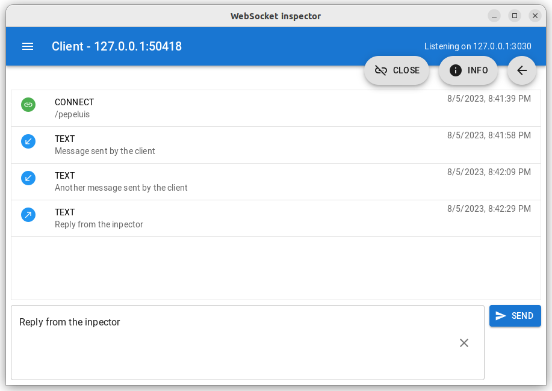

# WebSocket Inspector

WebSocket Inspector is a developer tool for testing WebSocket clients. Provides a WebSocket server and the UI to inspect and interact with the clients connected to the server.

You can use it to test and debug your WebSocket client applications mocking the messages provided by the service you are working with without having to use it.

It is multiplatform and can run on Windows, MacOS or Linux.

# Getting started

## Install and execute WebSocket Inspector

# License

WebSocket Inspector is licensed under the GNU General Public License, Version 3, 29 June 2007.

Copyright (C) 2023 Adrián Romero.
